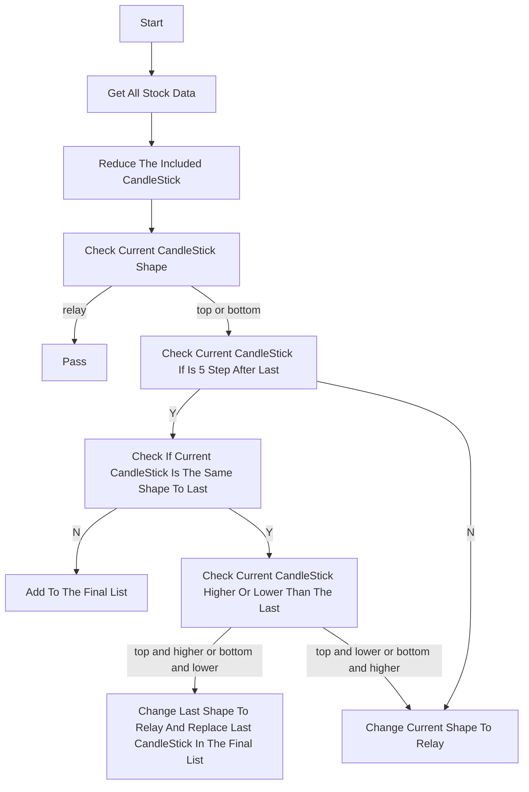
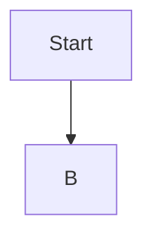

* Generate CandleStick Shape

```mermaid
graph TB
Start --> A[Get All Stock Data]
A --> B[Reduce The Included CandleStick]
B --> C[Check Current CandleStick Shape]
C --relay--> D[Pass]
C --top or bottom--> E[Check Current CandleStick If Is 5 Step After Last]
E --Y--> F[Check If Current CandleStick Is The Same Shape To Last]
E --N--> I
F --N--> End[Add To The Final List]
F --Y--> G[Check Current CandleStick Higher Or Lower Than The Last]
G --top and higher or bottom and lower--> H[Change Last Shape To Relay And Replace Last CandleStick In The Final List]
G --top and lower or bottom and higher--> I[Change Current Shape To Relay]
```

* identify middle center

```mermaid
graph TB
Start --> B
```